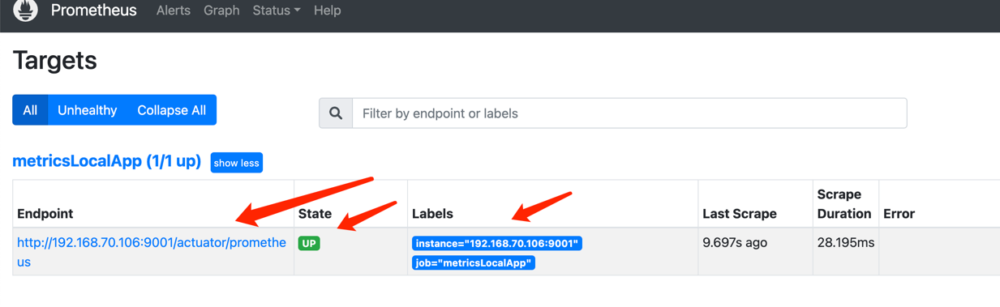
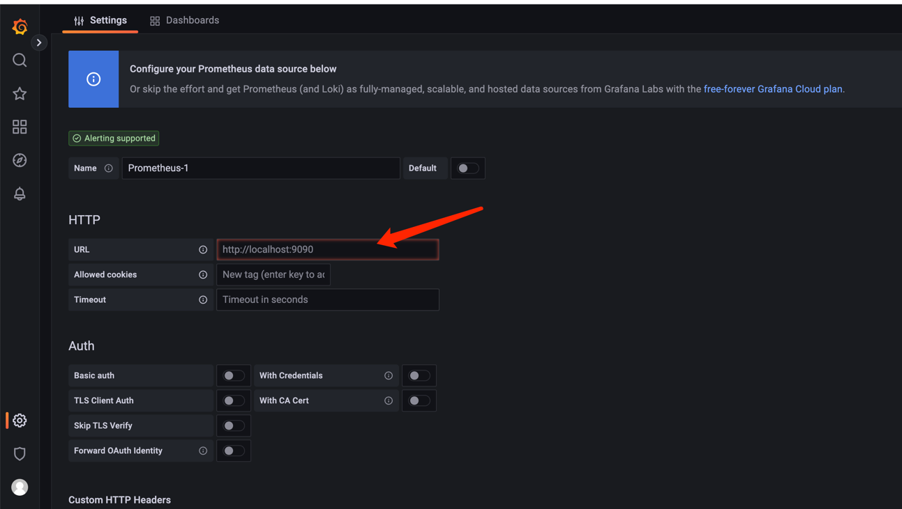
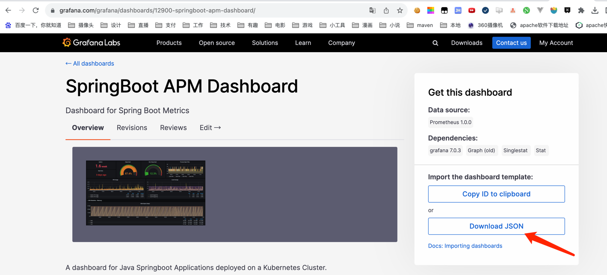
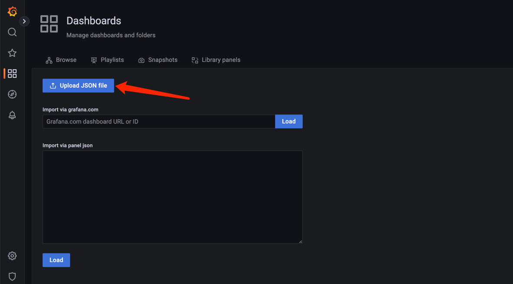
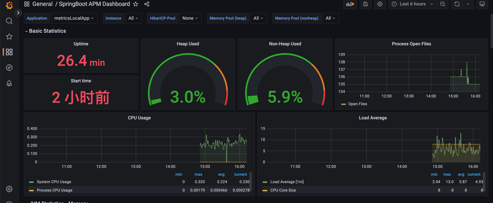

监控信息

### 1，先启动java应用
[查看是否能成功查看指标](http://192.168.70.106:9001/actuator/prometheus)

### 2，在本地创建prometheus.yml文件
```
global:
# 数据抓取频率
  scrape_interval: 60s
  # 数据评估频率
  evaluation_interval: 60s

# 抓取配置项 
scrape_configs:
   # 指定 springboot name标签
  - job_name: "metricsLocalApp"
   # 设定metrics 的路径
    metrics_path: "/actuator/prometheus"
    static_configs:
    # 配置目标关联 host，如果是本机的话，建议用  内网ip，而不用 localhost；
    - targets: ['192.168.70.106:9001']
```


### 3，docker 启动 grafana9.2 和 prometheus2.37

```
docker run -d -p 9090:9090 --name=prometheus2.37 -v /Users/yxy/work/docker/data/permetheus/prometheus.yml:/etc/prometheus/prometheus.yml  prom/prometheus:v2.37.5
docker run -d -p 3000:3000 --name=grafana9.2 -v /Users/yxy/work/docker/data/grafana/storage:/var/lib/grafana grafana/grafana:9.2.13
```

注意
**/Users/yxy/work/docker/data**要改成自己的地址


### 4，查看prometheus
[查看prometheus能否成功收集信息](http://localhost:9090/targets?search=)
如图表示成功



### 5，配置grafana
#### 5.1 [打开grafana](http://localhost:3000/datasources)默认用户名和密码均为admin
#### 5.2 配置prometheus的地址


#### 5.3 配置grafana面板
#### 可以在这个地址中去下载自己心仪的模板 https://grafana.com/grafana/dashboards/?search=springboot
#### https://grafana.com/grafana/dashboards/4701-jvm-micrometer/

然后导入到grafana



### 6，查看模板的统计信息
